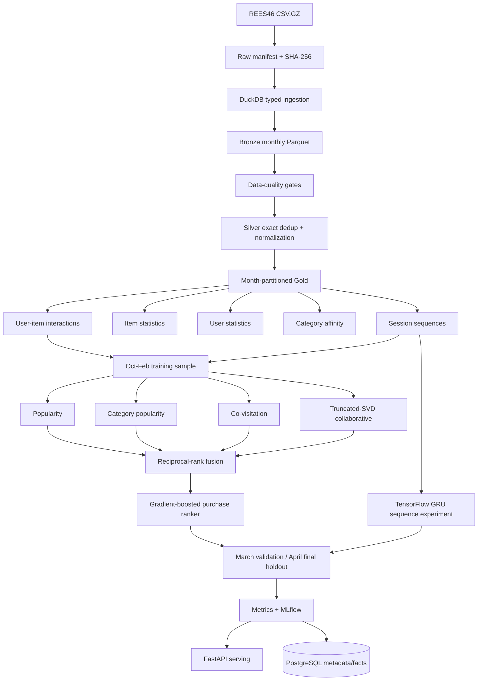

# Architecture

## Boundaries

Bronze is a typed faithful copy. Silver performs exact deduplication and normalization. Gold contains reusable behavioral facts. Modeling never reads March/April while fitting train-time models. March is the ranking/tuning surface and April is the future holdout.
